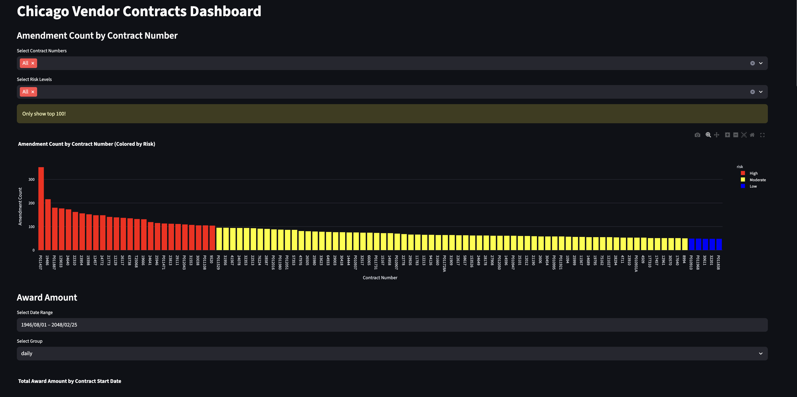

# Interview_Contracts_CityofChicago
## Setup
- Install and activate Python env
```bash
conda create -n city_chicago python=3.10 -y 

conda activate city_chicago
```

- Install dependecies
```bash
pip install -r requirements.txt
```


- Clone the dataset
```bash
git submodule update --init --recursive
```

*Note:* You must ensure huggingface credential is stored and  git-lfs is installed.


## Data cleaning and transformation
```bash
python part4.py
```

*Note:* By default, it will take `data/Competency Test_Contracts_20250721.csv` as input file path.

If you need run specifically:
```bash
python part4.py --file <contracts_csv_file_path>
```


## Data visluzation
```bash
streamlit run part5_visualization.py 
```

Then go to http://localhost:8501 and enjoy it !

